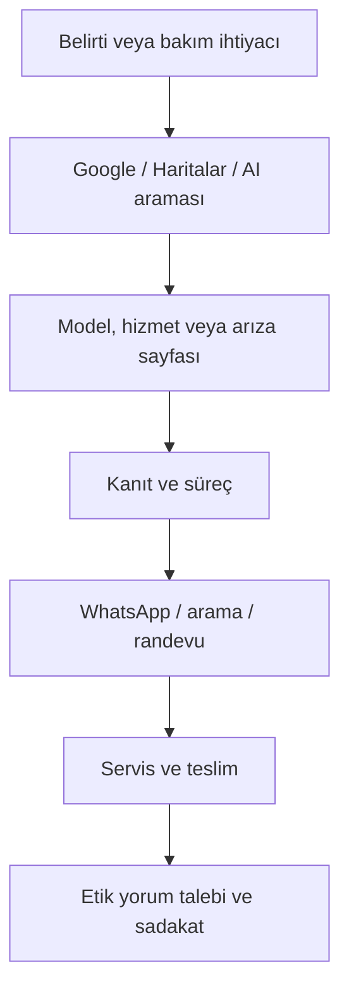

# SEO ve AEO stratejisi

## 1. Hedef

Amaç yalnızca `Adana Ford servis` sorgusunda görünmek değil; kullanıcının karar yolculuğunun tamamında A&S'yi en güvenilir ve en kolay ulaşılabilir seçenek haline getirmektir:

## 2. Gerçekçi başarı yaklaşımı

- Hiçbir teknik veya içerik çalışması tek başına “1. sıra garantisi” vermez.
- Yeni domainin otorite ve yerel sinyal toplaması zaman alır. Google değişikliklerin etkisinin birkaç hafta ile birkaç ay arasında görülebileceğini belirtir.
- Yerel pakette mesafe kontrol edilemez; alaka ve belirginlik sistematik biçimde güçlendirilebilir.
- Başarı; organik sıra kadar arama, WhatsApp, yol tarifi, randevu ve nitelikli iş emriyle ölçülür.

## 3. Anahtar kelime ve sayfa kümeleri

### 3.1 Ana ticari sorgular

| Arama niyeti | Ana sorgular | Hedef sayfa |
|---|---|---|
| Servis bulma | adana ford özel servis, ford servis adana | Ana sayfa |
| Usta bulma | adana ford ustası, ford tamircisi adana | Hakkımızda + ana sayfa |
| Bakım | ford periyodik bakım adana, ford ağır bakım adana | İlgili hizmet sayfası |
| Ticari araç | ford transit servis adana, courier servis adana | Model sayfası + ticari araç merkezi |
| Acil iletişim | ford yol yardım adana, ford arıza adana | Yalnızca gerçekten sunuluyorsa yol yardım sayfası |
| Konum | yakın ford özel servis, seyhan ford servis | İletişim/konum + gerçek ana lokasyon |

### 3.2 Hizmet kümesi

Öncelik gerçek hizmet ve kârlılık verisine göre kesinleştirilecek:

- Ford periyodik bakım
- Ford ağır bakım
- Bilgisayarlı arıza tespiti
- Motor bakım ve onarım
- Turbo kontrol/onarım
- Enjektör ve yakıt sistemi
- Şanzıman ve debriyaj
- Fren sistemi ve balata
- Ön takım/süspansiyon
- Oto elektrik ve elektronik
- Klima bakım/onarım
- DPF/partikül filtresi teşhis ve yasal temizlik çözümleri

> `EGR iptali`, `DPF iptali` veya emisyon sistemini işlevsizleştirmeyi teşvik eden içerikler planlanmayacak. Arıza tespiti, bakım, onarım ve mevzuata uygun çözümler anlatılacak.

### 3.3 Model kümesi

İlk dalga, müşterinin gerçek araç kabul verisine göre seçilmeli. Başlangıç adayı:

- Ford Focus
- Ford Fiesta
- Ford Transit
- Ford Transit Custom
- Ford Transit/Courier ve Tourneo Courier
- Ford Tourneo Connect / Transit Connect
- Ford Kuga
- Ford Ranger
- Ford Mondeo
- Ford C-Max
- Ford Puma ve EcoSport

Her model sayfası özgün olmalı; model adını değiştirerek çoğaltılmış metin kullanılmamalı.

### 3.4 Belirti/arıza rehberi kümesi

Ustanın gerçek deneyimi ve Ford teknik dokümanlarıyla doğrulanmadan yayınlanmayacak konu adayları:

- Ford motor arıza lambası neden yanar?
- Ford Transit çekişten düşme nedenleri
- Ford Focus hararet yapıyor: ilk kontroller
- Ford dizel araçta siyah/beyaz duman ne anlatır?
- Ford turbo arızasının belirtileri
- Ford enjektör arızası nasıl anlaşılır?
- Ford şanzıman arızası belirtileri
- Debriyaj/baskı balata bitme belirtileri
- DPF doluluk ve rejenerasyon belirtileri
- Klima soğutmuyor: olası nedenler
- Direksiyon titremesi ve ön takım sesleri
- Akü mü, marş dinamosu mu? Belirti farkları

## 4. Sayfa eşleme ve kanibalizasyon kuralı

Bir ana niyet = bir ana URL.

| URL | Birincil hedef | Destek sorguları |
|---|---|---|
| `/` | adana ford özel servis | ford servis adana, ford ustası adana |
| `/hizmetler/periyodik-bakim` | ford periyodik bakım adana | yağ filtre bakımı, bakım zamanı |
| `/hizmetler/ford-ariza-tespit` | ford arıza tespit adana | cihazla arıza tespiti |
| `/ford-modelleri/transit-servis` | ford transit servis adana | transit bakım, transit tamir |
| `/ariza-rehberi/transit-cekisten-dusuyor` | ford transit çekişten düşüyor | turbo, enjektör, DPF belirtileri |
| `/iletisim` | A&S Ford Servis adres/telefon | yol tarifi, çalışma saatleri |

`/adana-ford-servis`, `/ford-servis-adana`, `/adana-ford-ozel-servis` gibi aynı niyeti hedefleyen üç ayrı sayfa açılmayacak. Ana sayfa bu kümeyi karşılayacak.

## 5. Sayfa içi SEO standardı

Her indekslenebilir sayfa için:

- Tek ve açıklayıcı H1.
- 45–60 karakter hedefli, doğal title; kesin karakter sayısı uğruna anlam bozulmayacak.
- Yaklaşık 140–160 karakterde özgün meta açıklama; sıralama garantisi değil tıklama mesajı.
- Kısa, Türkçe ve açıklayıcı slug.
- Kendine işaret eden canonical.
- Open Graph/Twitter kartı.
- Gerçek fotoğraflarda açıklayıcı alt metin; dekoratif görsellerde boş alt.
- İlgili hizmet, model ve rehber sayfalarına bağlamsal iç bağlantı.
- Breadcrumb ve görünür sayfa yolu.
- Son güncelleme tarihi ve uzman kontrolü.
- Kullanıcı sorusuna ilk 80–120 kelimede doğrudan yanıt.
- İşlem kapsamı, kimler için uygun olduğu, süreç, süreyi etkileyenler, sık sorular ve CTA.

### Örnek title/meta

**Ana sayfa**

- Title: `Adana Ford Özel Servis | A&S Ford Servis`
- Description: `Ford binek ve hafif ticari araçlar için Adana'da bakım, arıza tespiti ve onarım. A&S Ford Servis'e ulaşın, randevu veya ön bilgi alın.`

**Transit sayfası**

- Title: `Adana Ford Transit Servisi | A&S Ford Servis`
- Description: `Ford Transit bakım, arıza tespiti, motor, turbo, enjektör ve fren işlemleri için A&S Ford Servis. Aracınızın sorununu WhatsApp'tan iletin.`

İddialar ve hizmetler yayından önce müşteriyle doğrulanmalıdır.

## 6. İçerik kalite standardı: “usta izi”

Rakipleri içerik adediyle değil, deneyim kanıtıyla geçmek için her önemli içerikte en az üç “usta izi” bulunmalı:

1. Belirtinin sürücü tarafından nasıl fark edildiği.
2. A&S'nin teşhis sırasında hangi kontrol sırasını izlediği.
3. Değişimden önce hangi onarım/ölçüm seçeneklerinin değerlendirildiği.
4. Model/motor/yıl ayrımı.
5. Güvenlik veya “aracı kullanmaya devam etmeyin” eşiği.
6. Gerçek bir vaka fotoğrafı ya da anonimleştirilmiş ölçüm.
7. Ustanın kısa yorumu.

İçerik şablonu:

1. 2–3 cümlelik doğrudan yanıt
2. Belirtiler
3. Olası nedenler
4. Acil mi, araç kullanılabilir mi?
5. Serviste nasıl teşhis edilir?
6. Çözüm seçenekleri
7. Süre/maliyeti neler etkiler? (kesin fiyat uydurmadan)
8. Model ve motor farklılıkları
9. Sık sorular
10. İlgili hizmet/model sayfaları
11. Foto/video gönder veya randevu al CTA'sı
12. Uzman kontrolü ve güncelleme tarihi

## 7. AEO / AI aramalarında görünürlük

AEO ayrı bir “AI için kelime doldurma” işi değildir. Cevapların açık, kaynaklanabilir ve varlıkların tutarlı olması gerekir.

### Uygulamalar

- Her sayfanın başında soruya net yanıt veren kısa özet.
- Soruları kullanıcı diliyle başlıklandırma: “Ford Transit neden çekişten düşer?”
- Cevaplarda kapsam ve belirsizlik: “En sık nedenler şunlardır; kesin neden cihaz ve fiziksel kontrolle belirlenir.”
- İşletme adı, adres, telefon, konum, çalışma saatleri ve hizmetlerin tüm kanallarda aynı olması.
- Usta/teknik danışman profil sayfası veya görünür uzman kutusu.
- Yayın ve güncelleme tarihi.
- Mümkün olduğunda Ford'un resmi kullanım/bakım kaynaklarına bağlantı.
- Gerçek vaka ve özgün görsel; stok/AI görselini teknik kanıt gibi kullanmama.
- Basit tablolar: belirti–olası neden–aciliyet–önerilen kontrol.
- HTML içinde erişilebilir içerik; yalnızca görsel/slayt/video içine gömülü kritik bilgi bırakmama.

### Yapılandırılmış veri

Planlanan JSON-LD:

- Ana sayfa/iletişim: `AutoRepair` + `LocalBusiness` özellikleri, `Organization`
- Hizmet sayfaları: `Service`
- İçerikler: `Article` veya uygun olduğunda `BlogPosting`
- Tüm alt sayfalar: `BreadcrumbList`
- Site: `WebSite`

Kurallar:

- Şema görünür içerikle birebir eşleşmeli.
- Adres, koordinat, telefon, çalışma saati ve görseller gerçek olmalı.
- Sahte puan/yorum şeması eklenmemeli.
- Google, kendi işletmesine ait “self-serving” yorum puanını LocalBusiness rich result olarak göstermeyebilir; puan şeması bir SEO hilesi olarak görülmemeli.
- FAQ bölümü kullanıcı için yararlıdır; genel ticari sitelerde FAQ zengin sonucunun çıkacağı vaat edilmemeli.
- Yayından önce Rich Results Test ve Schema Markup Validator ile kontrol edilmeli.

## 8. Yerel SEO ve Google İşletme Profili

Google, yerel sonuçların çoğunlukla **alaka, mesafe ve belirginlik** ile belirlendiğini açıklar. Mesafe sabit; diğer iki alan çalışılabilir.

### Profil temeli

- Resmi işletme adı tabelayla birebir; anahtar kelime ekleyerek isim spam'i yapılmaz.
- En doğru birincil kategori ve gerçek ikincil kategoriler seçilir.
- Tam adres, harita pini, telefon, çalışma ve özel gün saatleri.
- Randevu ve web sitesi URL'lerine UTM etiketleri.
- Hizmet listesi: Ford bakım, arıza tespiti vb. gerçek kapsam.
- Kısa, doğal işletme açıklaması; kampanya/telefon spam'i yok.

### Fotoğraf planı

İlk gün en az:

- Dış cephe/tabela: 5
- İç servis alanı: 8
- Ekip ve usta: 5
- Teşhis ekipmanları: 5
- Gerçek işlemler: 15
- Müşteri bekleme/araç kabul: varsa 3–5

Sonrasında haftada en az 2–3 yeni, tarihli gerçek fotoğraf.

### Yorum sistemi

- Araç tesliminde kısa bağlantı/QR ile tüm müşterilerden dürüst yorum istenir.
- Yorum karşılığında indirim/hediye verilmez; yalnızca memnun müşteriyi seçen “review gating” yapılmaz.
- Her yoruma 2 iş günü içinde doğal ve kişiye özel yanıt.
- Yanıtta yapılan hizmet/araç modeli yalnızca müşteri zaten paylaştıysa veya mahremiyet sorunu yoksa kullanılır.
- Olumsuz yorum silme baskısı yerine iletişim ve çözüm kaydı.

### Yerel atıf ve bağlantılar

- Oto sanayi sitesi/oda/dernek/tedarikçi dizinleri: gerçek üyelik veya iş ilişkisi varsa.
- Yerel haber ve otomotiv içerikleri: reklam etiketi ve gerçek haber değeriyle.
- Sponsor olunan yerel etkinlik/klüp: sahici ilişki ve marka görünürlüğü.
- Ford kullanıcı topluluklarında spam bağlantı değil, faydalı teknik katkı.
- Tüm dizinlerde NAP tutarlılığı.

## 9. Teknik SEO

### Tarama ve indeksleme

- `robots.txt` erişilebilir ve sitemap adresini içerir.
- XML sitemap yalnızca canonical, 200 dönen, indekslenebilir URL'leri içerir.
- HTML sitemap gerekirse footer'da; ana iç bağlantıların yerini tutmaz.
- 404/410, 301, canonical ve trailing slash standardı tek biçimde yönetilir.
- Arama/filtre/UTM parametreleri indeks şişmesine yol açmaz.
- Taslak, teşekkür ve form sonuç sayfaları `noindex`.

### Performans hedefleri

Google'ın önerdiği iyi eşikler 75. yüzdelik gerçek kullanıcı verisinde:

- LCP ≤ 2,5 saniye
- INP < 200 ms
- CLS < 0,1

Ek proje bütçeleri:

- İlk mobil yükte mümkünse ≤ 170 KB sıkıştırılmış JS.
- Hero görseli AVIF/WebP, doğru `srcset`, önceden boyutlandırılmış.
- Ana font en fazla iki aile ve sınırlı ağırlık; mümkünse self-host.
- Harita iframe'i kullanıcı etkileşimine kadar gecikmeli yüklenir.
- Üçüncü taraf chat/analytics betikleri izin ve performans bütçesiyle.
- Lighthouse mobil hedefi: Performance ≥ 90, Accessibility ≥ 95, Best Practices ≥ 95, SEO ≥ 95. Laboratuvar skoru iş hedefinin yerine geçmez.

### Render ve mimari

- Kritik metinler ilk HTML'de bulunmalı; yalnız istemci tarafı JS ile gelmemeli.
- SSG/SSR tercih edilmeli.
- Semantik HTML, doğru heading sırası ve klavye erişimi.
- Her sayfada benzersiz metadata ve canonical.
- Görseller için genişlik/yükseklik belirlenerek CLS önlenmeli.

## 10. Off-page ve otorite planı

Öncelik sırası:

1. Google İşletme Profili doğruluğu ve düzenli yorum.
2. Sosyal profillerde aynı isim/adres/telefon/site.
3. Tedarikçi/partner/oda bağlantıları.
4. Gerçek müşteri vaka içeriklerinin paylaşılması.
5. Yerel basın/etkinlik bağlantıları.
6. Faydalı Ford bakım rehberlerinin doğal paylaşımı.

Satın alınmış yüzlerce düşük kaliteli backlink, dizin spam'i, otomatik blog yorumları ve rakip ismine açılmış yanıltıcı sayfalar yapılmayacak.

## 11. Ölçüm kurulumu

- Google Search Console
- GA4 veya KVKK/çerez yaklaşımına uygun alternatif analitik
- Google İşletme Profili performans raporları
- Bing Webmaster Tools
- Her form için sunucu tarafı kayıt ve spam koruması
- UTM standardı

Temel etkinlikler:

- `click_phone`
- `click_whatsapp`
- `click_directions`
- `start_appointment`
- `submit_appointment`
- `submit_callback`
- `view_service`
- `view_model`
- `view_case`

Telefon/WhatsApp tıklaması tek başına iş emri değildir. Aylık raporda nitelikli talep ve servise dönüşen iş de ayrıca takip edilmelidir.

## 12. Kaynaklar

- [Google SEO Başlangıç Rehberi](https://developers.google.com/search/docs/fundamentals/seo-starter-guide)
- [Google LocalBusiness yapılandırılmış veri](https://developers.google.com/search/docs/appearance/structured-data/local-business)
- [Google Core Web Vitals](https://developers.google.com/search/docs/appearance/core-web-vitals)
- [Google yerel sıralama açıklaması](https://support.google.com/business/answer/7091?hl=tr)
- [Schema.org AutoRepair](https://schema.org/AutoRepair)
- [Schema.org Service](https://schema.org/Service)
